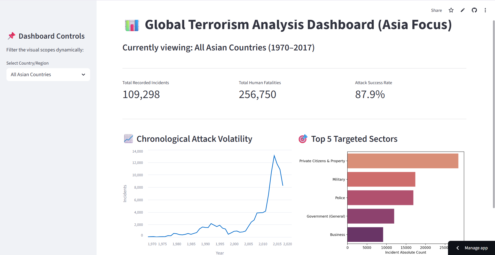
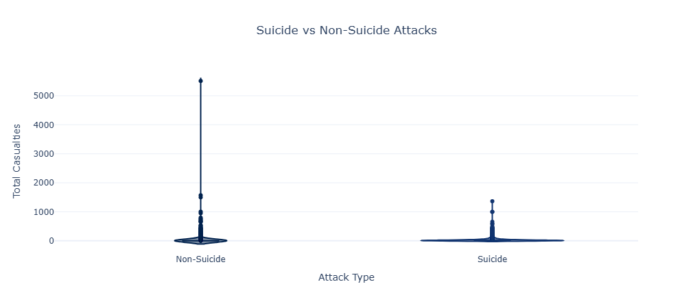
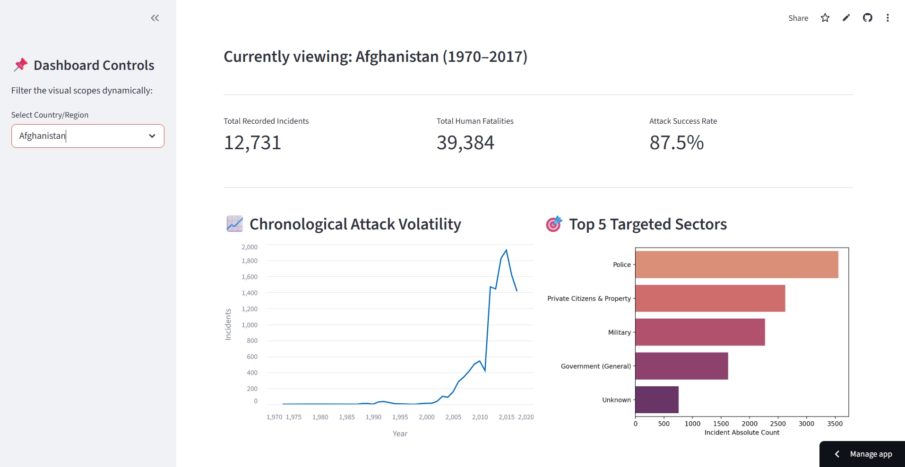

# 📊 Global Terrorism Data Analysis — Asia Focus (1970–2017)

[](https://global-terrorism-eda-project-irgeeeaueepbvc2nznwqfi.streamlit.app/)
[](https://www.python.org/)
[](https://jupyter.org/)
[-4B8BBE?style=for-the-badge)](https://www.start.umd.edu/gtd)

End-to-end **Exploratory Data Analysis** and **Statistical Hypothesis Testing** on the Global Terrorism Database (GTD), scoped to Asian regions (1970–2017). Includes a fully deployed interactive Streamlit dashboard with live country-level filtering across all KPIs and charts.

---

## 🖥️ Live Dashboard

> **[→ Open the live app](https://global-terrorism-eda-project-irgeeeaueepbvc2nznwqfi.streamlit.app/)**

<!-- SCREENSHOT 1: Full dashboard, All Asian Countries selected — hero image -->

*Full dashboard view — 3 live KPI cards (incidents, fatalities, success rate), attack timeline, and top targeted sectors. All metrics update dynamically when a country filter is applied.*

---

## 🔍 Key Findings

| Finding | Detail |
|---------|--------|
| 📈 **2014 was the peak year** | 13,071 attacks recorded — a 4× increase from 2010 levels, driven by geopolitical instability in the Middle East and South Asia |
| 💀 **Suicide attacks are 3× more lethal** | Violin plot + ANOVA (F = 965.59, p ≈ 0.0) confirms significantly higher average casualties vs. non-suicide attacks |
| 📉 **75% of incidents cause ≤ 2 fatalities** | Heavily right-skewed distribution — rare catastrophic events dominate the total death toll; log transformation applied |
| 🌍 **Iraq + Afghanistan dominate** | These two countries account for the majority of all Asian incidents — filtering to either dramatically shifts all metrics |
| 🎯 **Attack type predicts success** | Chi-Square (χ² = 5036.78, p ≈ 0.0) — tactical choice is a statistically significant predictor of operational outcome |

---

## 📂 Repository Structure

```
Global-Terrorism-EDA-Project/
├── data/
│   ├── processed_data/
│   │   ├── gtd_asia_cleaned.csv     ← cleaned, Asia-filtered dataset (56,000+ rows)
│   │   └── gtd_log.csv              ← log-transformed version for skewed columns
│   └── raw_data/
│       └── global_terrorism.csv
├── notebooks/
│   ├── 01_data_cleaning.ipynb       ← full cleaning & preprocessing pipeline
│   └── 02_eda_asia.ipynb            ← univariate, bivariate, multivariate EDA + hypothesis tests
├── screenshots/                     ← README visuals
├── app.py                           ← Streamlit interactive dashboard
├── requirements.txt
├── .gitignore
└── README.md
```

---

## 🧹 Data Cleaning Pipeline

`notebooks/01_data_cleaning.ipynb`

| Step | Action | Rationale |
|------|--------|-----------|
| Column filtering | Retained 21 of 135 original columns | Removed redundant coded duplicates |
| Date cleaning | Replaced `0` month/day values with midpoint estimates | GTD uses 0 for unknown dates |
| Casualty cleaning | `fillna(0)` + replaced `-99` sentinel values | Preserved zero-casualty events accurately |
| Regional filter | Extracted 5 Asian sub-regions | Scoped to 56,000+ relevant rows |
| Derived features | Added `Total_Casualties`, `Fatality_Rate`, `Decade` | Enabled richer multivariate analysis |
| Outlier detection | IQR method on Killed, Wounded, Property_Damage | Identified extreme events without removing them |
| Log transformation | `np.log1p()` on casualty columns | Reduced skewness from ~15 to ~1.2, enabling valid hypothesis testing |

---

## 📊 Analysis Depth

`notebooks/02_eda_asia.ipynb`

The analysis covers 13 charts across 3 levels of complexity:

**Univariate** — year-wise attack trends, monthly distribution, top countries, top provinces  
**Bivariate** — suicide vs. non-suicide casualties, attack type vs. casualty box plots, group-level lethality  
**Multivariate** — regional stacked attack distribution, killed vs. wounded bubble scatter (log scale), attack type × total casualties × frequency scatter, Pearson correlation heatmap

<!-- SCREENSHOT 4: Violin plot (suicide vs non-suicide) or bubble scatter from the notebook -->

*Violin + box plot overlay: suicide vs. non-suicide casualty distribution — visually confirms what ANOVA later validates statistically.*

---

## 📈 Interactive Dashboard Features

<!-- SCREENSHOT 2: Dashboard filtered to Iraq or Afghanistan -->

*Example: filtering to Iraq — all 3 KPI cards, the attack timeline, and the targeted sectors chart update simultaneously in real time.*

| Feature | Detail |
|---------|--------|
| Country filter | Dropdown covers all 30+ Asian countries in the dataset |
| KPI cards | Total incidents, total fatalities, attack success rate — all live |
| Attack timeline | Plotly line chart with hover tooltips |
| Targeted sectors | Top 5 sectors by incident count (Seaborn bar chart) |
| Caching | `@st.cache_data` decorator — dataset loads once, filters run instantly |

---

## 🧪 Statistical Validation

Two formal hypothesis tests anchor the analysis — results are non-random and reproducible:

### Hypothesis 1 — Attack Type vs. Success Rate (Chi-Square Test)

```
H₀: Attack type has no relationship with operational success
χ² statistic : 5036.78
p-value      : ≈ 0.0  →  H₀ REJECTED
```

**Interpretation:** Tactical choice is a statistically significant predictor of whether an attack succeeds. Bombing and armed assault achieve higher success rates than facility attacks — and this is not chance.

---

### Hypothesis 2 — Attack Strategy vs. Casualties (One-Way ANOVA)

```
H₀: Mean casualties are equal across all attack types
F-statistic : 965.59
p-value     : ≈ 0.0  →  H₀ REJECTED
```

**Interpretation:** Explosive-based attacks produce statistically higher casualties than hostage-taking or infrastructure targeting. Note: ANOVA was run on **log-transformed** casualty values (skewness reduced from ~15 to ~1.2) — this was a deliberate methodological choice to satisfy ANOVA's normality assumption. Running this test on raw values would be statistically invalid.

---

## 🚀 How to Run Locally

```bash
# 1. Clone the repository
git clone https://github.com/LXN77/Global-Terrorism-EDA-Project.git
cd Global-Terrorism-EDA-Project

# 2. Download the dataset (EULA-protected — cannot be hosted publicly)
# → https://www.kaggle.com/datasets/START-UMD/gtd
# Place as: data/raw data/global_terrorism.csv

# 3. Install dependencies
pip install -r requirements.txt

# 4. Run the cleaning notebook first (generates processed CSVs)
jupyter notebook notebooks/01_data_cleaning.ipynb

# 5. Launch the dashboard
streamlit run app.py
```

---

## 🛠️ Tech Stack

`Python 3.10` · `Pandas` · `NumPy` · `Matplotlib` · `Seaborn` · `Plotly` · `SciPy` · `Scikit-learn` · `Streamlit`

---

## ⚖️ Legal & Citation

Data sourced from the National Consortium for the Study of Terrorism and Responses to Terrorism (START), University of Maryland.

> National Consortium for the Study of Terrorism and Responses to Terrorism (START). (2018). *The Global Terrorism Database* [Data file]. https://www.start.umd.edu/gtd
